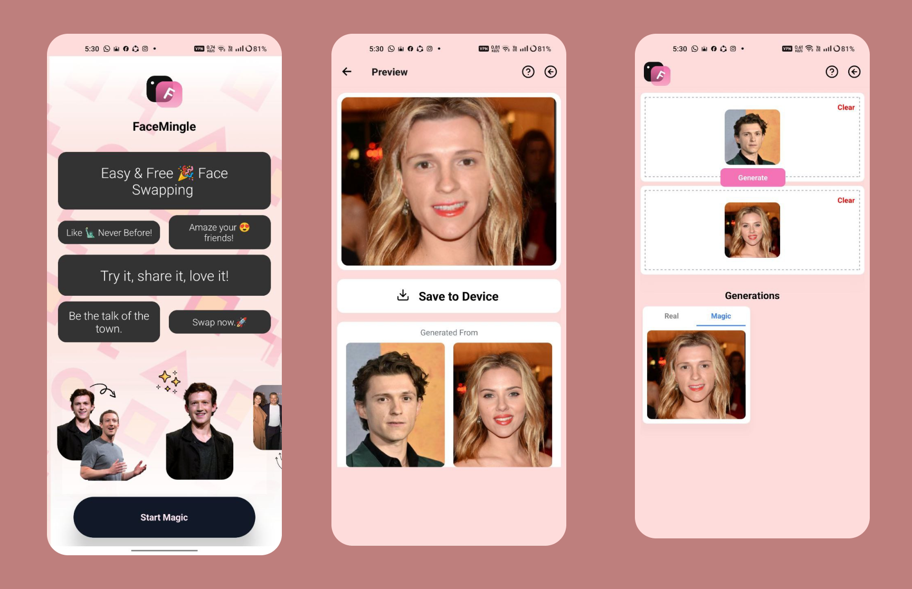

# FaceMingle 
Web App | Mobile App | Source Code

**OpenSource Face-Swap** for Free 

example of how that's work

Welcome to faceMingle,

an open-source project that combines the power of **Deep insight Insight-face**.

Tech Stacks:
- NEXT.JS Web application
- React Native (Expo) Mobile app
- Fast API for serve the model 

⚠️ **Note** 
- an Onnx model used for Process the image. it size(>500mb) like can't save in the Github large storage.
 
model_url : [Model Drive Link](https://drive.google.com/file/d/1krOLgjW2tAPaqV-Bw4YALz0xT5zlb5HF/view?usp=sharing)

Collaborations are Welcome!

Mobile App Screenshots:

